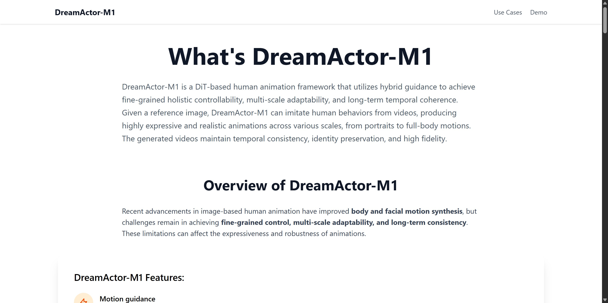

# DreamActor-M1

Tags: AI Video
Description: DreamActor-M1 is a DiT-based human animation framework that utilizes hybrid guidance to achieve fine-grained holistic controllability, multi-scale adaptability, and long-term temporal coherence. Given a reference image, DreamActor-M1 can imitate human behaviors from videos, producing highly expressive and realistic animations across various scales, from portraits to full-body motions. The generated videos maintain temporal consistency, identity preservation, and high fidelity.
URL: https://dreamactor-m1.com/
Date Added: April 3, 2025 1:09 PM
Type: Tool
Archive: No
Spark: No

