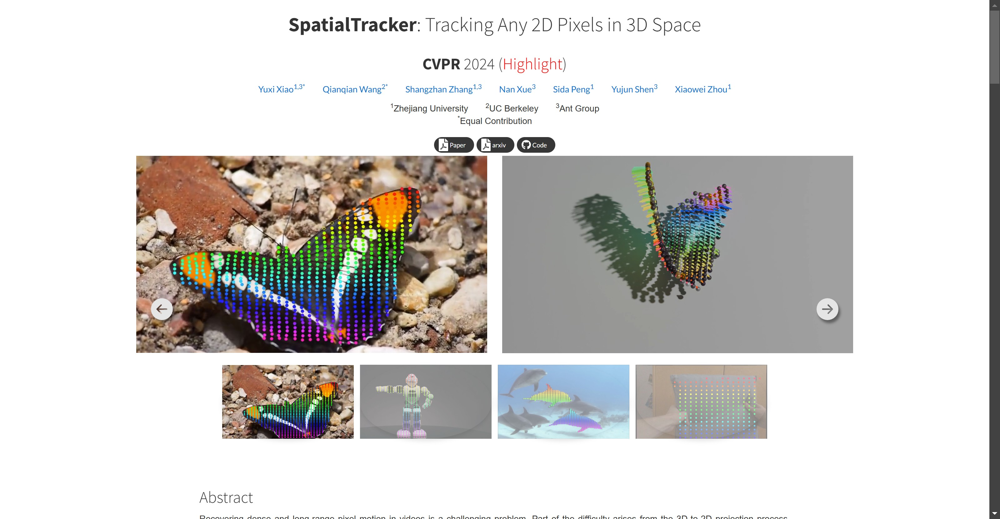

# SpatialTracker

Tags: AI Tracking
URL: https://henry123-boy.github.io/SpaTracker/
Date Added: January 11, 2025 11:59 AM
Type: Article
Archive: No
Spark: No

## **SpatialTracker**: Tracking Any 2D Pixels in 3D Space

### **CVPR** 2024 (Highlight)

- [Yuxi Xiao1,3*](https://henry123-boy.github.io/)
- [Qianqian Wang2*](https://qianqianwang68.github.io/)
- [Shangzhan Zhang1,3](https://zhanghe3z.github.io/)
- [Nan Xue3](https://xuenan.net/)
- [Sida Peng1](https://pengsida.net/)
- [Yujun Shen3](https://shenyujun.github.io/)
- [Xiaowei Zhou1](https://xzhou.me/)
- 1Zhejiang University
- 2UC Berkeley
- 3Ant Group
- *Equal Contribution

[Paper](https://henry123-boy.github.io/SpaTracker/SpatialTracker_files/pdf/spatracker.pdf) [arxiv](https://arxiv.org/abs/2404.04319) [Code](https://github.com/henry123-boy/SpaTracker)

 

 

### Abstract

Recovering dense and long-range pixel motion in videos is a challenging problem. Part of the difficulty arises from the 3D-to-2D projection process, leading to occlusions and discontinuities in the 2D motion domain. While 2D motion can be intricate, we posit that the underlying 3D motion can often be simple and low-dimensional. In this work, we propose to estimate point trajectories in 3D space to mitigate the issues caused by image projection. Our method, named **SpatialTracker**, lifts 2D pixels to 3D using monocular depth estimators, represents the 3D content of each frame efficiently using a triplane representation, and performs iterative updates using a transformer to estimate 3D trajectories. Tracking in 3D allows us to leverage as-rigid-as-possible (ARAP) constraints while simultaneously learning a rigidity embedding that clusters pixels into different rigid parts. Extensive evaluation shows that our approach achieves state-of-the-art tracking performance both qualitatively and quantitatively, particularly in challenging scenarios such as out-of-plane rotation.

### Qualitative Comparisons for 2D Tracking

We compare our method with TAPIR [1] and CoTracker [2] for 2D tracking. Our method can handle challenging scenarios such as out-of-plane rotation and occlusions.

TAPIR [1]

CoTracker [2]

SpatialTracker (Ours)

TAPIR [1]

CoTracker [2]

SpatialTracker (Ours)

TAPIR [1]

CoTracker [2]

SpatialTracker (Ours)

TAPIR [1]

CoTracker [2]

SpatialTracker (Ours)

TAPIR [1]

CoTracker [2]

SpatialTracker (Ours)

TAPIR [1]

CoTracker [2]

SpatialTracker (Ours)

TAPIR [1]

CoTracker [2]

SpatialTracker (Ours)

TAPIR [1]

CoTracker [2]

SpatialTracker (Ours)

### Rigid Part Segmentation from Videos

Our method identifies the different rigid parts in the scene by clustering their 3D trajectories. In the following, the rigid parts estimated by our method are shown in different colors.

 The first reference image

Tracking Results

Estimated Rigid Parts

 The first reference image

Tracking Results

Estimated Rigid Parts

 The first reference image

Tracking Results

Estimated Rigid Parts

## Application

### Camera Pose Estimation in Dynamic Scenes

We manually identify the static parts and estimate the camera poses from wild videos. We first estimate the 3D trajectories of pixels in the video using our SpatialTracker, decompose the scene into different rigid parts, and finally estimate the camera poses using PnP for the static part.

### References

1. Carl Doersch, Yi Yang, Mel Vecerík, Dilara Gokay, Ankush Gupta, Yusuf Aytar, João Carreira, Andrew Zisserman. TAPIR: Tracking Any Point with per-frame Initialization and temporal Refinement. ICCV 2023
2. Nikita Karaev, Ignacio Rocco, Benjamin Graham, Natalia Neverova, Andrea Vedaldi, Christian Rupprecht. CoTracker: It is Better to Track Together. [CoRR abs/2307.07635](https://arxiv.org/abs/2307.07635) 2023

### Concurrent Works

- Wang Bo and Li Jian and Yu Yang and Liu Li and Sun Zhenping and Hu Dewen. SceneTracker: Long-term Scene Flow Estimation Network. [CoRR abs/2403.19924](https://arxiv.org/pdf/2403.19924) 2024

### Citation

If you find our project useful, please consider citing:

AخA

@inproceedings{SpatialTracker,

title={SpatialTracker: Tracking Any 2D Pixels in 3D Space},

author={Xiao, Yuxi and Wang, Qianqian and Zhang, Shangzhan and Xue, Nan and Peng, Sida and Shen, Yujun and Zhou, Xiaowei},

booktitle={Proceedings of the IEEE/CVF Conference on Computer Vision and Pattern Recognition (CVPR)},

year={2024}

}

The website template was borrowed from [ClimateNeRF](https://climatenerf.github.io/),[Michaël Gharbi](http://mgharbi.com/), [RefNeRF](https://dorverbin.github.io/refnerf/index.html) , [Nerfies](https://nerfies.github.io/) and [Semantic View Synthesis](https://hhsinping.github.io/svs/supp/visual_comparison.html).