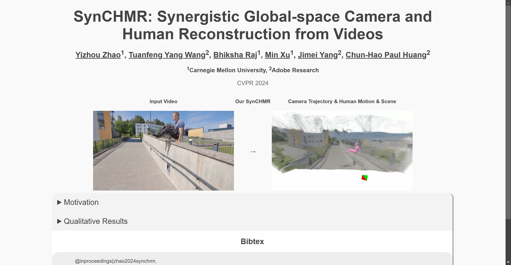

# SynCHMR

Tags: AI Video
URL: https://paulchhuang.github.io/synchmr/
Date Added: January 11, 2025 10:35 AM
Type: Github
Archive: No
Spark: No



Motivation

How to reconstruct camera trajectory, human motion, and scene in one global coordinate?

1. Human-aware Metric SLAM for resolving depth, scale, and dynamic ambiguities

Input Video

DROID-SLAM [54] Reconstructions with Depth Ambiguity

Our SynCHMR Reconstructions

Input Video

DROID-SLAM [54] Reconstructions with Scale Ambiguity

Our SynCHMR Reconstructions

Input Video

DROID-SLAM [54] Reconstructions with Dynamic Ambiguity

Our SynCHMR Reconstructions

2. Scene-aware SMPL Denoising for enforcing spatiotemporal coherencies and applying dynamic scene constraints

Input Video

SLAHMR [62] Reconstructions with Static Scene

Our SynCHMR Reconstructions with Dynamic Scene Qualitative Results 3DPW - downtown_walkBridge_01

Input

SLAHMR [62]

Our SynCHMR

3DPW - downtown_walkDownhill_00

Input

SLAHMR [62]

Our SynCHMR

3DPW - downtown_warmWelcome_00

Input

SLAHMR [62]

Our SynCHMR

3DPW - outdoors_crosscountry_00

Input

SLAHMR [62]

Our SynCHMR

3DPW - outdoors_parcours_00

Input

SLAHMR [62]

Our SynCHMR

EgoBody - recording_20211002_S03_S18_03

Input

SLAHMR [62]

Our SynCHMR

EgoBody - recording_20211004_S12_S20_04

Input

SLAHMR [62]

Our SynCHMR

EgoBody - recording_20220215_S21_S22_01

Input

SLAHMR [62]

Our SynCHMR

DAVIS - lady-running

Input

SLAHMR [62]

Our SynCHMR

DAVIS - lindy-hop

Input

SLAHMR [62]

Our SynCHMR

DAVIS - soapbox

Input

SLAHMR [62]

Our SynCHMR

DAVIS - walking

Input

SLAHMR [62]

Our SynCHMR

## Bibtex

```
            @inproceedings{zhao2024synchmr,
                author    = {Zhao, Yizhou and Wang, Tuanfeng Y. and Raj, Bhiksha and Xu, Min and Yang, Jimei and Huang, Chun-Hao P.},
                title     = {Synergistic Global-space Camera and Human Reconstruction from Videos},
                journal   = {Proceedings IEEE/CVF Conf.~on Computer Vision and Pattern Recognition (CVPR)},
                month     = Jun,
                year      = {2024},
            }
```