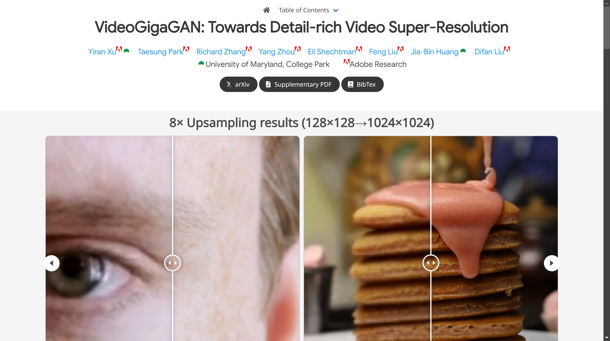

# VideoGigaGAN

Tags: AI Video
Description: VideoGigaGAN
URL: https://videogigagan.github.io/
Date Added: January 11, 2025 10:18 AM
Type: Article
Archive: No
Spark: No



[Taesung Park](https://taesung.me/)   
[Richard Zhang](https://richzhang.github.io/)   
[Yang Zhou](https://yzhou359.github.io/)   
[Eli Shechtman](https://research.adobe.com/person/eli-shechtman/)   
[Feng Liu](https://pages.cs.wisc.edu/~fliu/)   
[Jia-Bin Huang](https://jbhuang0604.github.io/)🐢    [Difan Liu](https://difanliu.github.io/)


🐢University of Maryland, College Park        Adobe Research


[arXiv](https://arxiv.org/pdf/2404.12388.pdf) [Supplementary PDF](https://videogigagan.github.io/assets/supp.pdf) [BibTex](https://videogigagan.github.io/#BibTeX)

## 8× Upsampling results (128×128→1024×1024)

Our model is able to upsample a video up to 8× with rich details.

## Abstract

Video super-resolution (VSR) approaches have shown impressive temporal consistency in upsampled videos. However, these approaches tend to generate blurrier results than their image counterparts as they are limited in their generative capability. This raises a fundamental question: can we extend the success of a generative image upsampler to the VSR task while preserving the temporal consistency? We introduce VideoGigaGAN, a new generative VSR model that can produce videos with high-frequency details and temporal consistency. VideoGigaGAN builds upon a large-scale image upsampler -- GigaGAN. Simply inflating GigaGAN to a video model by adding temporal modules produces severe temporal flickering. We identify several key issues and propose techniques that significantly improve the temporal consistency of upsampled videos. Our experiments show that, unlike previous VSR methods, VideoGigaGAN generates temporally consistent videos with more fine-grained appearance details. We validate the effectiveness of VideoGigaGAN by comparing it with state-of-the-art VSR models on public datasets and showcasing video results with 8× super-resolution.

## Overview: Why is it challenging?

## Method Overview


Our Video Super-Resolution (VSR) model is built upon the asymmetric U-Net architecture of the image GigaGAN upsampler. To enforce temporal consistency, we first inflate the image upsampler into a video upsampler by adding temporal attention layers into the decoder blocks. We also enhance consistency by incorporating the features from the flow-guided propagation module. To suppress aliasing artifacts, we use Anti-aliasing block in the downsampling layers of the encoder. Lastly, we directly shuttle the high frequency features via skip connection to the decoder layers to compensate for the loss of details in the BlurPool process.

## Ablation study

Strong hallucination capability of image GigaGAN results in temporally flickering artifacts, especially aliasing caused by the artifacted LR input.

1

Slide to switch between different examples

We progressively add components to the base model to handle these artifacts →

Image GigaGAN (base model) +Temp Attention +Feature propagation +Anti-aliasing +HF shuttle

Image GigaGAN

GT

Input

Comparison with GT

## Comparison with previous methods

Compared to previous models, our models provides a detail-rich result with comparable temporal consistency.

1

Input

EDVR MuCAN BasicVSR IconVSR TTVSR BasicVSR++

BasicVSR++

Ours

Comparison

GT

## Results on generic videos (128×128→512×512)

Our model is able to handle generic videos of different categories.

## BibTeX

```
@article{xu2024videogigagan,
      title={VideoGigaGAN: Towards Detail-rich Video Super-Resolution}, 
      author={Yiran Xu and Taesung Park and Richard Zhang and Yang Zhou and Eli Shechtman and Feng Liu and Jia-Bin Huang and Difan Liu},
      year={2024},
      eprint={2404.12388},
      archivePrefix={arXiv},
      primaryClass={cs.CV}
  }
```