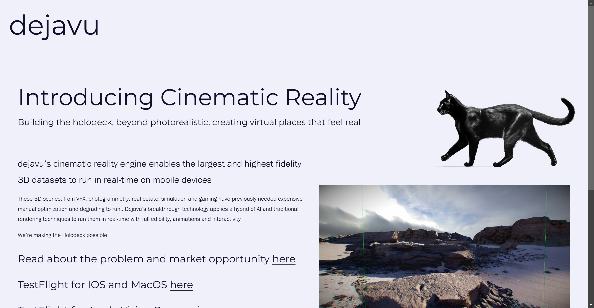

# dejavu

Tags: AI 3D Model
URL: https://www.djv.ai/
Date Added: January 11, 2025 12:38 PM
Type: Tool
Archive: No
Spark: No

dejavu’s cinematic reality engine enables the largest and highest fidelity 3D datasets to run in real-time on mobile devices

These 3D scenes, from VFX, photogrammetry, real estate, simulation and gaming have previously needed expensive manual optimization and degrading to run,. Dejavu’s breakthrough technology applies a hybrid of AI and traditional rendering techniques to run them in real-time with full edibility, animations and interactivity

We’re making the Holodeck possible

### Read about the problem and market opportunity [here](https://medium.com/@mattmiesnieks/introducing-cinematic-reality-7c93a6620beb)

### TestFlight for IOS and MacOS [here](https://testflight.apple.com/join/IyB1lEok)

### TestFlight for Apple Vision Pro coming soon

### WebXR demo coming soon

[Release Notes](https://app.notion.com/p/143826e454c38072964bfdfaed8bd634?pvs=21)